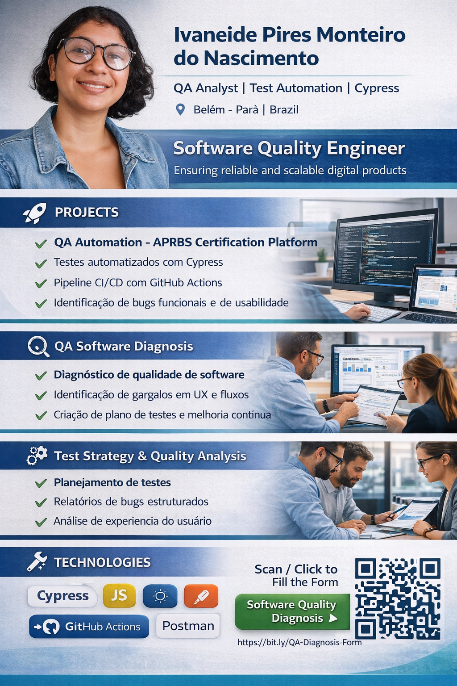

# QA Software Quality Diagnosis

  

---

# 🔎 QA Software Quality Diagnosis

This project was created to help companies **identify software quality problems and testing maturity gaps** through a structured **Quality Assurance diagnostic assessment**.

The goal is to allow companies to describe technical issues in their systems so that a **QA analysis can identify risks, weaknesses and improvement opportunities.**

---

# 🧠 QA Maturity Assessment

The diagnostic form evaluates the **testing maturity level** of a system based on several aspects:

• QA processes  
• Test automation  
• Infrastructure and CI/CD  
• Impact of bugs in production  
• Testing strategy and coverage  

Based on the answers, the system generates a **QA Maturity Score (0–100)** and classifies the project into maturity levels.

| Score | QA Maturity Level |
|------|------------------|
| 0–25 | Level 1 — Initial |
| 26–50 | Level 2 — Developing |
| 51–75 | Level 3 — Structured |
| 76–100 | Level 4 — Advanced |

---

# 📝 QA Diagnosis Form

Companies can fill out the **Software Quality Diagnosis Form**.

📊 **Access the form:**

https://docs.google.com/forms/d/e/1FAIpQLSf6slGehypENE1hqV9ftjujWHvlR6O5lc7Tld9LPkCNslfT_Q/viewform

The responses are analyzed to identify **technical risks and quality improvement opportunities.**

---

# 🔍 What will be analyzed

Based on the responses it is possible to detect:

- usability problems
- functional failures
- performance bottlenecks
- regression risks
- unstable releases
- broken workflows
- lack of automated testing
- weak QA processes

---

# 🚀 What can be delivered

After the analysis, the following QA artifacts can be proposed:

✔ Test Strategy  
✔ Test Plan  
✔ Test Automation Plan  
✔ Structured Bug Reports  
✔ Software Quality Diagnosis  
✔ UX and usability improvements  
✔ QA Documentation

---

# 💻 Example QA Project

This repository is connected to a **QA automation project using Cypress**.

Example capabilities demonstrated:

✔ Automated UI tests  
✔ Functional test validation  
✔ CI/CD pipeline with GitHub Actions  
✔ Identification of usability and functional bugs

---

# 🧰 Technologies used

- Cypress
- JavaScript
- GitHub Actions
- Test Automation
- CI/CD
- QA Analysis

---

# 🧠 What this project demonstrates

This project demonstrates my ability to:

- analyze software quality risks
- design QA diagnostic frameworks
- define testing strategies
- identify UX and functional issues
- propose automation strategies
- create QA documentation

---

# 🇧🇷 Diagnóstico de Qualidade de Software

Este projeto foi criado para ajudar empresas a **identificar problemas de qualidade em seus sistemas** através de uma **análise estruturada de QA (Quality Assurance).**

A proposta é permitir que empresas descrevam desafios em seus sistemas para que seja possível realizar uma avaliação técnica e propor melhorias.

---

## 🎯 Objetivo

Permitir que empresas descrevam problemas em seus sistemas para possibilitar:

- análise de riscos de software
- identificação de falhas funcionais
- criação de planos de teste
- melhoria da experiência do usuário
- definição de estratégias de QA
- identificação de necessidades de automação de testes

---

# 👩‍💻 Author

**Ivaneide Pires Monteiro do Nascimento**

QA Analyst | Test Automation | Cypress  
Belém – Pará, Brazil

🔗 LinkedIn  
https://linkedin.com/in/ivaneidepmn

---

⭐ This repository is part of my **Software Quality Assurance Portfolio**